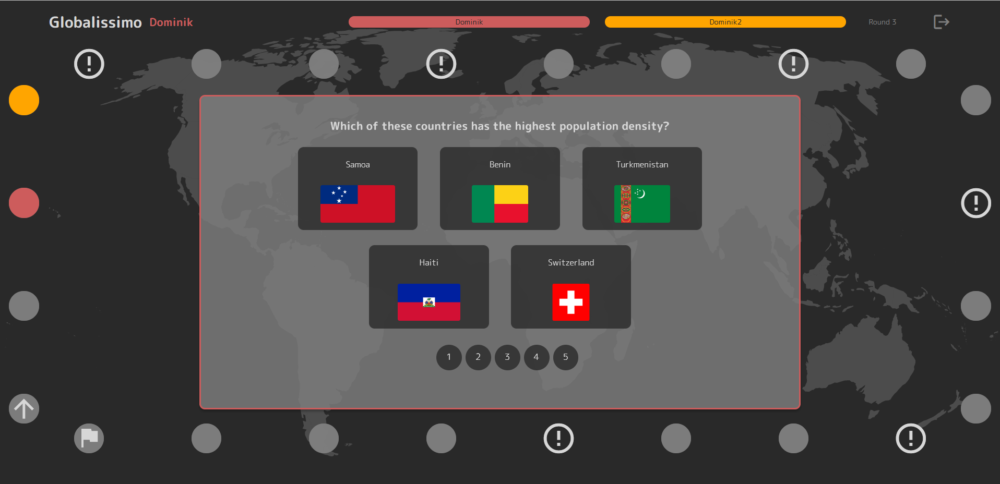
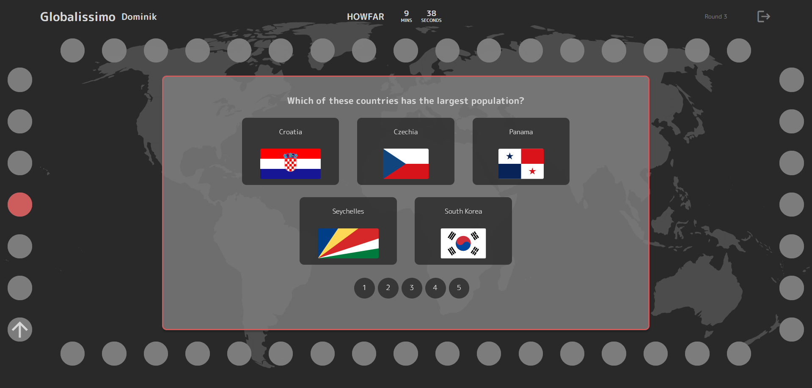
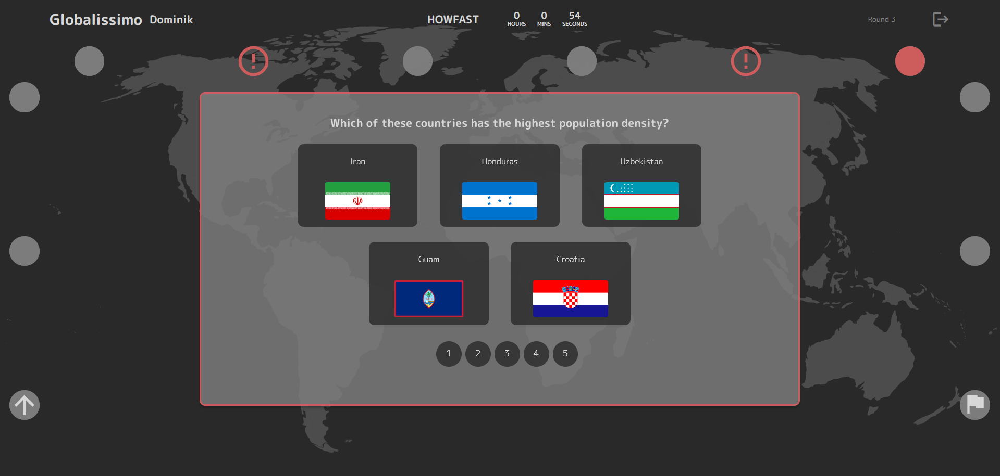

# Globalissimo - SoPra Project FS23, Group 29

**Test your geography knowledge in a fun board game, solo or with other players.**

Our goal is to provide a game that is not only fun to play, but also improves the players' geograhpical knowledge. Users can show off their skills in multiplayer games with up to 6 players, or challenge themselves in our two solo player game modes.

This repository contains the front end client side of the project. The server side can be found in [this repository](https://github.com/sopra-fs23-group-29/sopra-fs23-group-29-server)


## Technologies

The front end is written in JavaScript using React. For the communication between the client and the server, REST endpoints are used. For the communication during a runnign game a websocket STOMP protocol is used.

## High-Level Components

From a user persepctive, the basic views of the game are the [Login](./src/components/views/Login.js) and [Registration](./src/components/views/Registration.js) screens, the [Home](./src/components/views/Home.js) screen and the different [Game](./src/components/views/Game.js) screens.

The Login/Registration screen are the entry point for a new user where she can login/register. Upon success, each user is directed to the Home screen where joinable lobbies are displayed or the user has the option to open up a multiplayer or singleplayer game of their own.

The Game screen is the heart of the experience, combining different UI elements like the [Board](./src/components/ui/Board.js) and the different [question views](./src/components/ui/CountryRanking.js) during a runnign game, orchestrating the information received through the websocket channels from the server. It decided when to show the question, when to move the players on the board or when to show a result or game over screen.

## Launch & Deployment

### Build & Run locally

The project is built using npm. To run the project in development mode run
```
npm run dev
```
The development mode allows you to make changes to the code and see the effects directly in your local browser through `http://localhost:3000`

### Deployment

The prod version of the application is deployed on the Google Cloud Platform (GCP) App Engine using a CI/CD pipeline through Github Actions. The steps upon push on the main branch are specified in this [yml file](.github/workflows/main.yml).

Upon push on main, all the test are run (using [sonarcloud](https://sonarcloud.io/projects) for test reports and metrics) and then the workflow tries to deploy the app.

This [link](https://console.cloud.google.com/appengine/services?serviceId=default&hl=de&project=sopra-fs23-group-29-client) takes you the GCP project.

## Illustrations










## Roadmap
- Enhanced UI showing the movement of the players on the board more clear
- Global solo mode leaderboard
- Friends list and the possibility to invite friends

## Authors and Acknoledgement

- **Dominik Arnold**
- **Nils Bohnenblust**
- **Thalia Lynn Fox**
- **Ramona Walker**
- **Mark Woolley**

We want to thank our teaching assistant Jerome Maier for the support during the semester and Alejandro Matos for providing the great REST Countries API free of charge.

## License

MIT License

Copyright (c) [2023]

Permission is hereby granted, free of charge, to any person obtaining a copy
of this software and associated documentation files (the "Software"), to deal
in the Software without restriction, including without limitation the rights
to use, copy, modify, merge, publish, distribute, sublicense, and/or sell
copies of the Software, and to permit persons to whom the Software is
furnished to do so, subject to the following conditions:

The above copyright notice and this permission notice shall be included in all
copies or substantial portions of the Software.

THE SOFTWARE IS PROVIDED "AS IS", WITHOUT WARRANTY OF ANY KIND, EXPRESS OR
IMPLIED, INCLUDING BUT NOT LIMITED TO THE WARRANTIES OF MERCHANTABILITY,
FITNESS FOR A PARTICULAR PURPOSE AND NONINFRINGEMENT. IN NO EVENT SHALL THE
AUTHORS OR COPYRIGHT HOLDERS BE LIABLE FOR ANY CLAIM, DAMAGES OR OTHER
LIABILITY, WHETHER IN AN ACTION OF CONTRACT, TORT OR OTHERWISE, ARISING FROM,
OUT OF OR IN CONNECTION WITH THE SOFTWARE OR THE USE OR OTHER DEALINGS IN THE
SOFTWARE.
